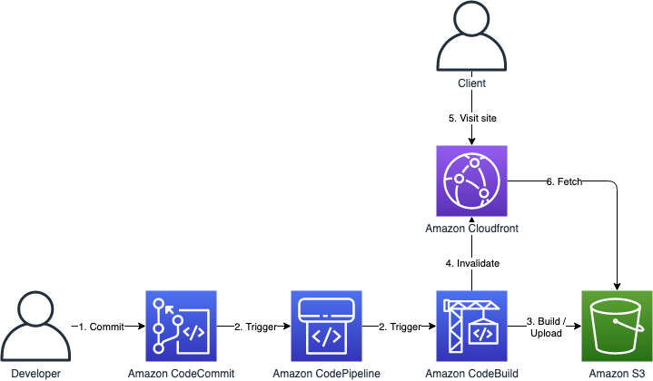

# Next.js S3 Deploy Block

This repository is for hosting Nextjs project using private S3(no public-read) via Cloudfront



# Prerequisites

- Nodejs 10.x
- AWS Account and Locally configured AWS credential

# Installation

Install project dependencies

```bash
$ npm i -g cdk@1.83.0
$ npm i
$ cdk bootstrap
```

# Usage

## Create nextjs repo

create repository to Codecommit

```bash
$ aws codecommit create-repository --repository-name nextjs-example
```

clone sample project, in this case we gonna use [this](https://github.com/haandol/nextjs-example) repo and push it to Codecommit repo

```bash
$ git clone https://github.com/haandol/nextjs-example
$ cd nextjs-example
$ git remote set-url origin codecommit::ap-northeast-2://nextjs-example
$ git push
```

## Setup config

edit `Repository` varialbe at [**lib/interfaces/config.ts**](lib/interfaces/config.ts)

```bash
$ vim lib/interfaces/config.ts
```

the repository should be Codecommit git repository

## Deploy CDK Stacks on AWS

```bash
$ cdk deploy "*" --require-approval never
```

# Cleanup

destroy provisioned cloud resources

```bash
$ cdk destroy "*"
```
